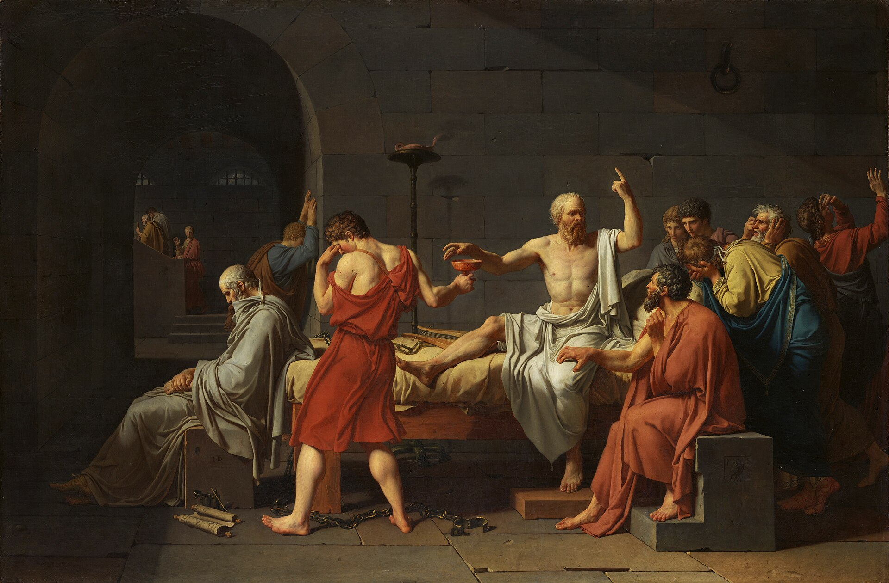

# 🏛️ philosopher-council

     

<p align="center">
  
</p>
<p align="center">
  <em>Jacques-Louis David, <strong>The Death of Socrates</strong> (1787) - hemlock in reach, finger still raised, argument still running.<br>The founding mood of this project: the questioning does not stop. (Public domain, via Wikimedia Commons.)</em>
</p>

**An eleven-philosopher LLM council.** Ask it a question - Socrates interrogates it, Kant universalises it, Lao Tzu subtracts from it, and Ibn ʿArabī weaves their verdicts into one reading. Or point it at the AI-research firehose (Reddit / Hacker News / arXiv) and let the council triage what's worth your attention.

**Methodology, not metaphysics.** The philosophers are prompt-engineered lenses, not séance guests. The model is a language model. No production prompt claims the system has a soul, awareness, or being.

---

## 💬 Ask the council anything

```bash
pnpm ask "Is chain-of-thought prompting genuine reasoning or imitation?"
pnpm ask --full-council "Should agentic AI systems spend money autonomously?"
pnpm ask --context "We run a 5-agent trading desk" "Where should a human stay in the loop?"
```

Each deliberator answers in character - virtue scores, reasoning, concerns - then the synthesizer speaks last. This is **real, unedited output** from the council's first live full-council run, where it was asked to judge its own premise:

```
> Question: Is a council of eleven philosophers better than a single
  model answering alone?

## Kant (ethics) - 0.69
**Plurality checks the autocrat in each reasoner, yet only if each
voice retains its critical independence.**

## Lao Tzu (metaphysics) - 0.35
**Eleven voices speaking where one silence would suffice - the Tao
laughs at our multiplication of parts.**
"When water finds its path, it does not convene a symposium of streams."

## Avicenna (epistemology) - 0.66
"Strip away the theatrical apparatus of 'eleven voices.' What remains?
...these are masks upon one face."

## Ibn ʿArabī - synthesis (0.61)
The scores cluster narrowly because all recognize the same ambiguity:
'better' floats undefined, and structural diversity (eleven prompts)
may not produce epistemic diversity (eleven independent reasoning
paths) when all voices share one substrate.

Final score: 0.58 · Recommendation: track
```

The council declined to amplify itself. The 0.35-0.69 score spread is the interesting result: prompt-differentiated personas produce genuinely opposed verdicts even on a shared substrate.

📜 **[Read the full transcript](examples/01-the-council-judges-itself.md)** - all ten opinions, the synthesis, and the self-critique pass, unedited. Transcripts from your own runs are saved to `data/asks/<date>-<question>.md`.

## 🤔 Why philosophy, and why now

Philosophy is already running inside production AI - it's just uncredited:

- **Constitutional AI** (Anthropic's own training method) is literally a written constitution of normative principles the model deliberates against - applied moral philosophy as a training loop.
- **RLHF** is preference utilitarianism with a reward model.
- **AI safety guardrails** are deontology: rules that hold regardless of outcome.
- **Interpretability research** is epistemology: *how do we know what the model knows?*
- **Karpathy's "LLM Council"** showed that multiple model perspectives beat one - this project takes the obvious next step and gives the perspectives 2,500 years of documented methodology.

And there's a fitting irony in the plumbing: **Anthropic** takes its name from the Greek *ánthrōpos* - "human." A company named *human* built the model; this council uses it to put humanity's oldest reasoning traditions - Athens, Baghdad, Córdoba, Qufu - back in the judgment seat over AI's newest claims. The wheel turns full circle: the machines trained on everything we ever wrote are steered by the best of what we ever thought.

So: if a constitution of principles can align a model, a council of philosophers can interrogate one. Same move, made explicit.

## ⚡ First sixty seconds (no API key needed)

```bash
pnpm install
pnpm build                          # type-check
pnpm test                           # vitest, all dry-run mocks

$env:DRY_RUN = "1"                  # (PowerShell) or DRY_RUN=1 on bash
pnpm ask "What is a benchmark, really?"   # mock model, instant
pnpm trends:run --offline           # full pipeline on fixture data
```

## 🔑 Live mode (Claude API)

```bash
cp .env.example .env                # add ANTHROPIC_API_KEY=sk-ant-...
pnpm ask "your question"            # 5 Claude calls (quorum) per question
pnpm ask --full-council "..."       # 11 calls - every philosopher speaks
pnpm trends:run                     # triage today's AI-research trends
```

Default model is `claude-sonnet-4-5` (set `ANTHROPIC_MODEL` or `DEFAULT_MODEL` to override).

## 🔀 Mixed councils (multi-provider)

Every seat can run on a different provider. Model specs are `provider:model`, covering **Anthropic**, **OpenAI**, **Gemini**, and local **Ollama**:

```bash
# .env
DEFAULT_MODEL=anthropic:claude-sonnet-4-5
COUNCIL_MODELS=laotzu=ollama:llama3.1,kant=openai:gpt-4o,descartes=gemini:gemini-2.0-flash,ralph=anthropic:claude-haiku-4-5-20251001
```

Now Lao Tzu deliberates on a local 7B (fitting, for the philosopher of doing less), Kant runs on GPT-4o, Descartes doubts via Gemini, and the self-critique loop uses a cheap fast model. Seat ids are the philosopher ids plus `ibnarabi` (synthesizer) and `ralph` (critic). Each opinion records which `provider:model` produced it.

| Spec prefix  | Endpoint                                  | Key required        |
| ------------ | ----------------------------------------- | ------------------- |
| `anthropic:` | Anthropic Messages API                    | `ANTHROPIC_API_KEY` |
| `openai:`    | OpenAI chat completions                   | `OPENAI_API_KEY`    |
| `gemini:`    | Gemini OpenAI-compat endpoint             | `GEMINI_API_KEY`    |
| `ollama:`    | local Ollama (`OLLAMA_BASE_URL` override) | none                |

## 🏛️ The eleven philosophers

| Branch         | Quorum candidates                                              |
| -------------- | -------------------------------------------------------------- |
| Epistemology   | Socrates, Avicenna, Al-Ghazālī, Descartes, Kant                |
| Metaphysics    | Plato, Lao Tzu, Avicenna, Ibn Rushd, Descartes                 |
| Ethics         | Socrates, Aristotle, Confucius, Lao Tzu, Al-Ghazālī, Kant      |
| Logic          | Aristotle, Ibn Rushd                                           |
| **Synthesis**  | **Ibn ʿArabī** - fixed seat, speaks last, weaves the verdicts  |

Quorum mode seats one philosopher per branch, selected deterministically from the item id - the same question always convenes the same bench. Full-council mode seats all ten deliberators. Ibn ʿArabī always closes.

Every opinion is scored against the **four cardinal virtues** - Wisdom, Courage, Justice, Temperance ∈ [0, 1] - using the rubrics in [`canon/02-virtue-rubrics.md`](canon/02-virtue-rubrics.md), making verdicts from very different methodologies commensurable.

## 🔄 Pipeline stages

```
ask ─────────────────┐
                     ├──> council ──> ralph (self-critique) ──> verdict
fetch ──> filter ────┘                                            │
                                                    digest <──────┘
```

- **ask** (`src/pipeline/ask.ts`) - wraps your question as the item under deliberation
- **fetch** (`src/fetchers/`) - Reddit `new.json`, HN Algolia, arXiv RSS (`cs.AI`, `cs.LG`); dedupe via `data/.seen.json`
- **filter** (`src/filter/`) - keyword regex set + recency/upvote heuristic
- **council** (`src/council/`) - one Claude call per seat, JSON-only opinions; Ibn ʿArabī synthesises
- **ralph** (`src/council/ralph.ts`) - self-critique loop, max 2 iterations, early-stops at `stopConfidence ≥ 0.6`
- **digest** (`src/pipeline/digest.ts`) - daily Markdown digest grouped by `amplify` / `track` / `ignore`

## 📁 Project layout

```
canon/            seed texts the council must cite (LLM Wiki pattern)
data/             generated artifacts (gitignored)
src/
  council/        registry, quorum, client, ralph, 11 personas
  fetchers/       reddit, hn, arxiv
  filter/         keyword + heuristic scoring
  pipeline/       ask / fetch / analyze / digest / run
  store/          JSON-on-disk persistence
  mock/           fixtures + mock Claude client (DRY_RUN=1)
tests/            vitest, all dry-run
STOIC_AI_MANIFESTO.md   the long-form design philosophy
```

## 🚫 What this is not

- Not a claim that the model is conscious. The philosophical framing is methodology.
- Not a prediction market. Verdicts are judged by reasoning quality, not by whether a trend pans out.
- Not a replacement for human judgment. The council's output is a starting point for a human to read, not a decision.

---

## 🌐 Connect

[](https://www.linkedin.com/in/umairtareen/) [](https://www.tiktok.com/@quantify.life) [](https://x.com/UAT_34) [](https://github.com/umair-tareen)

*Built by Umair Tareen*
