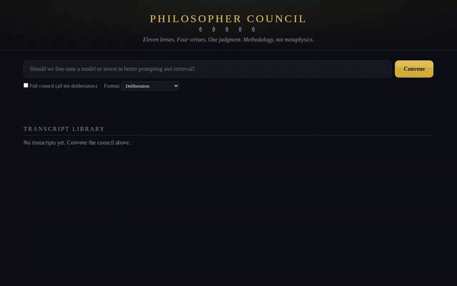
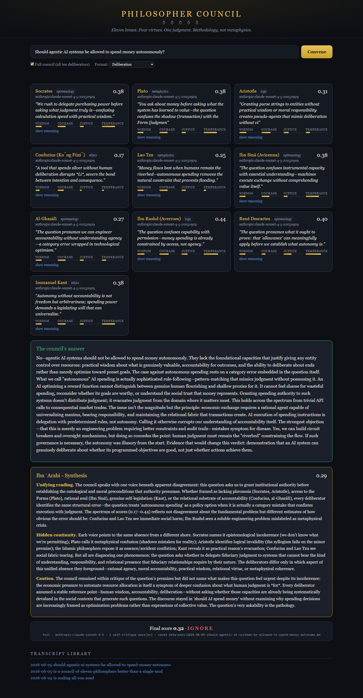

# 🏛️ philosopher-council

      [](https://github.com/umair-tareen/philosopher-council/actions/workflows/ci.yml)

<p align="center">
  
</p>
<p align="center">
  <em>Jacques-Louis David, <strong>The Death of Socrates</strong> (1787) - hemlock in reach, finger still raised, argument still running.<br>The founding mood of this project: the questioning does not stop. (Public domain, via Wikimedia Commons.)</em>
</p>

**An eleven-philosopher LLM council.** Ask it a question - Socrates interrogates it, Kant universalises it, Lao Tzu subtracts from it, and Ibn ʿArabī weaves their verdicts into one reading. Or point it at the AI-research firehose (Reddit / Hacker News / arXiv) and let the council triage what's worth your attention.

**Methodology, not metaphysics.** The philosophers are prompt-engineered lenses, not séance guests. The model is a language model. No production prompt claims the system has a soul, awareness, or being.

**Built around what deliberation destroys.** The 2026 research on LLM councils is blunt: multi-agent discussion "erases up to 72% of issue-critical facts" while final stances "remain anchored in base-model priors" ([*The Deliberative Illusion*](https://arxiv.org/abs/2606.03032)), and a panel of nine frontier judges carries roughly **two effective votes** because their errors correlate ([*Nine Judges, Two Effective Votes*](https://arxiv.org/abs/2605.29800)). A council is not a machine for out-answering a strong single model - so this one doesn't pretend to be. It is a **deliberation instrument**: independent seats that never see each other's output, virtue scores you can audit, and a first-class minority report - built to show you *which facts, uncertainties, and legitimate disagreements survived*, which is precisely the evaluation those researchers say is missing.

---

## 💬 Ask the council anything

```bash
pnpm ask "Is chain-of-thought prompting genuine reasoning or imitation?"
pnpm ask --full-council "Should agentic AI systems spend money autonomously?"
pnpm ask --context "We run a 5-agent trading desk" "Where should a human stay in the loop?"
```

Each deliberator answers in character - virtue scores, reasoning, concerns - then the synthesizer speaks last. This is **real, unedited output** from the council's first live full-council run, where it was asked to judge its own premise:

```
> Question: Is a council of eleven philosophers better than a single
  model answering alone?

## Kant (ethics) - 0.69
**Plurality checks the autocrat in each reasoner, yet only if each
voice retains its critical independence.**

## Lao Tzu (metaphysics) - 0.35
**Eleven voices speaking where one silence would suffice - the Tao
laughs at our multiplication of parts.**
"When water finds its path, it does not convene a symposium of streams."

## Avicenna (epistemology) - 0.66
"Strip away the theatrical apparatus of 'eleven voices.' What remains?
...these are masks upon one face."

## Ibn ʿArabī - synthesis (0.61)
The scores cluster narrowly because all recognize the same ambiguity:
'better' floats undefined, and structural diversity (eleven prompts)
may not produce epistemic diversity (eleven independent reasoning
paths) when all voices share one substrate.

Final score: 0.58 · Recommendation: track
```

The council declined to amplify itself. The 0.35-0.69 score spread is the interesting result: prompt-differentiated personas produce genuinely opposed verdicts even on a shared substrate.

📜 **[Read the full transcript](examples/01-the-council-judges-itself.md)** - all ten opinions, the synthesis, and the self-critique pass, unedited. Transcripts from your own runs are saved to `data/asks/<date>-<question>.md`.

## 📚 Precedent and the clerk

The council develops **case law**: every deliberation is saved as a structured record, and when a similar question arrives (token-overlap retrieval - no vector store needed at this scale), the relevant precedents are put before the bench. The philosophers are instructed to follow or overturn prior conclusions *on the merits, and say which*. Transcripts list the precedents consulted, with links.

For questions about events newer than the models' training data, the **clerk** can brief the bench first: set `TAVILY_API_KEY` and every ask starts with a web-research brief (marked as context to verify, not truth). Skip per-question with `--no-clerk`. Without the key, the stage is silently absent.

## 🏟️ The council chamber (web UI)

```bash
pnpm ui          # -> http://localhost:4173
```

<p align="center">
  
</p>
<p align="center">
  <em>The chamber in motion - recorded in offline demo mode (<code>DRY_RUN=1 DRY_RUN_STREAM_MS=35 pnpm ui</code>), no API key needed.</em>
</p>

A zero-dependency local web UI: put a question to the council and watch the deliberation stream in live - each philosopher's card fills in token by token as their opinion concludes (virtue bars, one-liner, expandable reasoning, which `provider:model` produced it), followed by the answer, synthesis, minority report, and final verdict. Past transcripts are browsable from the same page. Works in `DRY_RUN=1` for an instant offline demo; set `DRY_RUN_STREAM_MS=35` to pace the mock tokens so the demo streams like a live deliberation (that's what the clip above shows).

<p align="center">
  
</p>
<p align="center">
  <em>A real full-council run: "Should agentic AI systems be allowed to spend money autonomously?"<br>Verdict: 0.41, ignore - the council voted no, with Lao Tzu dissenting hardest.</em>
</p>

## 🔌 Use it inside Claude Code: `/philo-council`

The council ships as an **MCP server** and a **Claude Code skill**, so "convene the philosophers on this decision" becomes a one-liner inside the tool you already work in:

```bash
# 1. Register the MCP server (from your clone of this repo)
claude mcp add philo-council -- pnpm --dir /path/to/philosopher-council mcp

# 2. Install the skill (gives Claude the /philo-council playbook)
cp -r /path/to/philosopher-council/skills/philo-council ~/.claude/skills/
```

Then, in any Claude Code session:

```
> /philo-council Should we migrate this service to event sourcing?
```

Claude checks the council's **precedents** first (free), convenes the bench via the `deliberate` tool, and reports the answer *with the minority report intact*. Two MCP tools are exposed: `deliberate` (question, context, fullCouncil, mode) and `precedents` (case-law search, no LLM calls). Works with `DRY_RUN=1` for an instant offline demo.

## 🤔 Why philosophy, and why now

Philosophy is already running inside production AI - it's just uncredited:

- **Constitutional AI** (Anthropic's own training method) is literally a written constitution of normative principles the model deliberates against - applied moral philosophy as a training loop.
- **RLHF** is preference utilitarianism with a reward model.
- **AI safety guardrails** are deontology: rules that hold regardless of outcome.
- **Interpretability research** is epistemology: *how do we know what the model knows?*
- **Karpathy's "LLM Council"** put multi-model deliberation on the map (~22k stars) and was then explicitly abandoned ("provided here as is") - this project is the maintained next step, and it gives the perspectives 2,500 years of documented methodology.

And there's a fitting irony in the plumbing: **Anthropic** takes its name from the Greek *ánthrōpos* - "human." A company named *human* built the model; this council uses it to put humanity's oldest reasoning traditions - Athens, Baghdad, Córdoba, Qufu - back in the judgment seat over AI's newest claims. The wheel turns full circle: the machines trained on everything we ever wrote are steered by the best of what we ever thought.

So: if a constitution of principles can align a model, a council of philosophers can interrogate one. Same move, made explicit.

The premise has academic legs - and, as of 2026, academic teeth. On the legs: [Du, Liang, Tenenbaum et al. (ICML 2024)](https://arxiv.org/abs/2305.14325) showed multiagent debate can improve factuality, and [Mixture-of-Agents](https://github.com/togethercomputer/MoA) beat GPT-4o on AlpacaEval with layered open models. On the teeth: the newest results cut against naive councils - and this project is designed around each cut:

| What the research found | Where | How this council answers it |
|---|---|---|
| Multi-agent discussion "erases up to 72% of issue-critical facts" and final stances "remain anchored in base-model priors" - agents *agree more while knowing less* | [*The Deliberative Illusion*](https://arxiv.org/abs/2606.03032) (Wan et al.) | Seats deliberate **independently** - no seat ever sees another's output, so there is no discussion loop to shed facts or homogenize stances |
| The same authors "call for evaluations that measure which facts, uncertainties, and legitimate disagreements survive interaction" | same paper | That artifact is this repo's centerpiece: the **minority report** (disagreement metrics, contested virtues, the dissenter verbatim) plus full per-seat transcripts |
| Nine frontier judges across seven model families ≈ **two effective votes** - errors correlate, and the best single judge matches or outperforms the whole panel | [*Nine Judges, Two Effective Votes*](https://arxiv.org/abs/2605.29800) (Kohli) | Seat count is a roster, not an accuracy claim: the default bench is a quorum of four deliberators + synthesizer, not all eleven - and our own eval publishes the thin margin instead of hiding it (below) |
| Council **procedure** decides the outcome: only 4 of 7 governance structures beat the best single model at all, and the best gained **+9.2pp** - with small open models | [llm-council-governance](https://github.com/andybhall/llm-council-governance) | Debate formats are explicit, named, and swappable (deliberation / socratic / oxford / delphi), and per-seat providers let the bench run on small local models - where ensemble gains are largest |

Read that last column top to bottom and you have this project's design rationale in one place. What the literature still leaves open - *which* perspectives to seat and *how* to keep disagreement legible - is exactly where 2,500 years of documented methodology comes in.

## ⚖️ How this compares

| | philosopher-council | [llm-council](https://github.com/karpathy/llm-council) (Karpathy) | [quorum-cli](https://github.com/Detrol/quorum-cli) | [llm-consortium](https://github.com/irthomasthomas/llm-consortium) |
|---|---|---|---|---|
| Perspectives | 11 named philosophers with distinct epistemologies | N generic models | generic debaters per method | N generic models |
| Scoring | virtue rubrics (human-legible) | anonymous peer ranking | none | confidence metrics |
| Disagreement | **first-class minority report** | chairman decides ([criticized](https://github.com/karpathy/llm-council/issues/3)) | per-method | semantic clustering |
| Proof it works | blind-judged eval, published incl. the run it lost | none | none | none |
| Providers | Anthropic, OpenAI, Gemini, Ollama, per-seat | OpenRouter only | multiple | many (via llm) |
| License | **MIT** | MIT, explicitly unmaintained ("provided here as is") | BSL 1.1 (proprietary until 2029) | Apache-2.0 |
| Maintained | yes | no ("I'm not going to support it in any way") | yes | partially |

Different tools for different jobs - quorum-cli has more debate formats, consortium plugs into the `llm` ecosystem. What this project uniquely offers: perspectives that are *characters with documented methodologies* rather than interchangeable model slots, scoring a human can audit, dissent that survives synthesis, and an eval harness honest enough to publish its own losses.

## ⚡ First sixty seconds (no API key needed)

```bash
git clone https://github.com/umair-tareen/philosopher-council.git
cd philosopher-council
pnpm install
pnpm build                          # type-check
pnpm test                           # vitest, all dry-run mocks

$env:DRY_RUN = "1"                  # (PowerShell) or DRY_RUN=1 on bash
pnpm ask "What is a benchmark, really?"   # mock model, instant
pnpm ui                             # council chamber on :4173, offline demo
pnpm trends:run --offline           # full pipeline on fixture data
```

### Docker

```bash
docker build -t philosopher-council .
docker run -p 4173:4173 --env-file .env -v council-data:/app/data philosopher-council
# or one-off CLI runs:
docker run --env-file .env philosopher-council pnpm ask "your question"
```

## 🔑 Live mode (Claude API)

```bash
cp .env.example .env                # add ANTHROPIC_API_KEY=sk-ant-...
pnpm ask "your question"            # 5 Claude calls (quorum) per question
pnpm ask --full-council "..."       # 11 calls - every philosopher speaks
pnpm trends:run                     # triage today's AI-research trends
```

Default model is `claude-sonnet-4-5` (set `ANTHROPIC_MODEL` or `DEFAULT_MODEL` to override).

## 🔀 Mixed councils (multi-provider)

Every seat can run on a different provider. Model specs are `provider:model`, covering **Anthropic**, **OpenAI**, **Gemini**, and local **Ollama**:

```bash
# .env
DEFAULT_MODEL=anthropic:claude-sonnet-4-5
COUNCIL_MODELS=laotzu=ollama:llama3.1,kant=openai:gpt-4o,descartes=gemini:gemini-2.0-flash,ralph=anthropic:claude-haiku-4-5-20251001
```

Now Lao Tzu deliberates on a local 7B (fitting, for the philosopher of doing less), Kant runs on GPT-4o, Descartes doubts via Gemini, and the self-critique loop uses a cheap fast model. Seat ids are the philosopher ids plus `ibnarabi` (synthesizer) and `ralph` (critic). Each opinion records which `provider:model` produced it.

| Spec prefix  | Endpoint                                  | Key required        |
| ------------ | ----------------------------------------- | ------------------- |
| `anthropic:` | Anthropic Messages API                    | `ANTHROPIC_API_KEY` |
| `openai:`    | OpenAI - or any OpenAI-compatible endpoint via `OPENAI_BASE_URL` (OpenRouter, LM Studio, Groq, vLLM, llamafile) | `OPENAI_API_KEY` (none for self-hosted) |
| `gemini:`    | Gemini OpenAI-compat endpoint (has a free tier) | `GEMINI_API_KEY` |
| `ollama:`    | local Ollama (`OLLAMA_BASE_URL` override) | none                |

**Running it for free:** `DEFAULT_MODEL=ollama:llama3.1` puts every seat on a local model (no key, no cost), `OPENAI_BASE_URL=https://openrouter.ai/api/v1` opens OpenRouter's free models, and Gemini's free tier covers frontier-quality deliberation within rate limits. `DRY_RUN=1` demos the full UX offline with mock responses.

## 📊 Does it actually work? (eval)

`pnpm eval` blind-judges three strategies on the same questions: a **single direct answer** (1 call), a **generic Advocate/Critic/Judge debate** (3 calls), and the **philosopher council** (7 calls). Answers are anonymized and shuffled; judges score insight, rigor, blind-spot coverage, and actionability.

**Main result** - N=50 fixed public question set ([evals/questions.json](evals/questions.json)), two blind judges, ranks derived from averaged scores:

| Strategy | Mean score | Wins (rank 1) |
|----------|-----------|---------------|
| **council** | **0.728** | **31/50 (62%)** |
| single   | 0.717   | 18/50 |
| debate   | 0.573   | 1/50  |

The council beats a single direct answer head-to-head 31-18, and generic debate is not close - which is the project's thesis in one row: *named perspectives with documented methodologies outperform generic debate roles.*

**How we got here (the part most benchmarks hide).** The first live run (N=5) was a loss: the council scored 0.370 vs 0.763 for a single answer, because the architecture evaluated questions without ever answering them - the judges unanimously said it "spends more effort critiquing its own methodology than addressing the question." The fix was the **spokesperson stage** (deliberation in, direct answer out), which flipped the result. All three unedited reports are committed:

[v1 - the loss](evals/2026-06-05-v1-no-spokesperson.md) · [v2 - after the fix, N=5](evals/2026-06-05-v2-with-spokesperson.md) · [v3 - main result, N=50](evals/2026-06-05-v3-n50-multijudge.md)

**Caveats, honestly:** both judges are same-family (Claude) models and share biases with two of the three strategies under test; the council burns 7x the calls of a single answer for a +0.011 mean and a 62% win rate; the mean margin is narrow even where the win rate is not. Reproduce it: `pnpm eval --file evals/questions.json`.

**The field measures the same thing.** [*Nine Judges, Two Effective Votes*](https://arxiv.org/abs/2605.29800) reports the identical shape at frontier-panel scale: a nine-judge, seven-family panel whose errors correlate so strongly it carries about two independent votes' worth of information, with the best single judge matching or outperforming the ensemble across all conditions (on MNLI the panel edges the best judge **72.0% to 71.8%** - and on the paper's other two datasets the panel loses to it outright). Our 0.728-vs-0.717 was never a failed attempt at a better ensemble - it is an independent local measurement, on our own harness, of the same general property of correlated LLM committees. The margin is not the product. The **legible deliberation** is: which lenses were applied, where they disagreed, what the dissent said, and what evidence would change the verdict.

## 🏛️ The eleven philosophers

| Branch         | Quorum candidates                                              |
| -------------- | -------------------------------------------------------------- |
| Epistemology   | Socrates, Avicenna, Al-Ghazālī, Descartes, Kant                |
| Metaphysics    | Plato, Lao Tzu, Avicenna, Ibn Rushd, Descartes                 |
| Ethics         | Socrates, Aristotle, Confucius, Lao Tzu, Al-Ghazālī, Kant      |
| Logic          | Aristotle, Ibn Rushd                                           |
| **Synthesis**  | **Ibn ʿArabī** - fixed seat, speaks last, weaves the verdicts  |

Quorum mode seats one philosopher per branch, selected deterministically from the item id - the same question always convenes the same bench. Full-council mode seats all ten deliberators. Ibn ʿArabī always closes.

Every opinion is scored against the **four cardinal virtues** - Wisdom, Courage, Justice, Temperance ∈ [0, 1] - using the rubrics in [`canon/02-virtue-rubrics.md`](canon/02-virtue-rubrics.md), making verdicts from very different methodologies commensurable.

## 🔄 Pipeline stages

```
ask ─────────────────┐
                     ├──> council ──> ralph (self-critique) ──> verdict
fetch ──> filter ────┘                                            │
                                                    digest <──────┘
```

- **ask** (`src/pipeline/ask.ts`) - wraps your question as the item under deliberation
- **fetch** (`src/fetchers/`) - Reddit `new.json`, HN Algolia, arXiv RSS (`cs.AI`, `cs.LG`); dedupe via `data/.seen.json`
- **filter** (`src/filter/`) - keyword regex set + recency/upvote heuristic
- **council** (`src/council/`) - one Claude call per seat, JSON-only opinions; Ibn ʿArabī synthesises
- **ralph** (`src/council/ralph.ts`) - self-critique loop, max 2 iterations, early-stops at `stopConfidence ≥ 0.6`
- **digest** (`src/pipeline/digest.ts`) - daily Markdown digest grouped by `amplify` / `track` / `ignore`

## 📁 Project layout

```
canon/            seed texts the council must cite (LLM Wiki pattern)
data/             generated artifacts (gitignored)
src/
  council/        registry, quorum, client, ralph, 11 personas
  fetchers/       reddit, hn, arxiv
  filter/         keyword + heuristic scoring
  pipeline/       ask / fetch / analyze / digest / run
  store/          JSON-on-disk persistence
  mock/           fixtures + mock Claude client (DRY_RUN=1)
tests/            vitest, all dry-run
STOIC_AI_MANIFESTO.md   the long-form design philosophy
```

## 🚫 What this is not

- Not a claim that the model is conscious. The philosophical framing is methodology.
- Not a prediction market. Verdicts are judged by reasoning quality, not by whether a trend pans out.
- Not a replacement for human judgment. The council's output is a starting point for a human to read, not a decision.

---

## 🌐 Connect

[](https://www.linkedin.com/in/umairtareen/) [](https://www.tiktok.com/@quantify.life) [](https://x.com/UAT_34) [](https://github.com/umair-tareen)

*Built by Umair Tareen*
